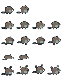
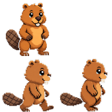

# Beaver Buddy 🦫

A pixel-art desktop beaver for macOS and Windows. It hatches from a lodge on first
launch, then roams your desktop, drops the occasional quip, and **evolves as you
burn AI tokens** — a Tamagotchi for people who live in Claude Code and Codex.

> Built by **[AI Beavers](https://github.com/ai-beavers)** — a global community of
> builders. Contributors welcome (see [Contributing](#contributing) below).

<p align="center">
  
  &nbsp;&nbsp;
  
</p>
<p align="center"><em>baby → teen — the beaver evolves as you burn tokens</em></p>

## What it does

- **Lives on your desktop** — a transparent, always-on-top, **click-through** overlay
  (it never steals a click, keystroke, or focus) plus a menu-bar tray icon.
- **Hatches once** — first run plays a Pokémon-style lodge hatch, then the baby beaver
  settles in and starts roaming the screen edges.
- **Talks** — canned pixel speech-bubble quips (all-lowercase beaver voice) fire
  on events: app start, long coding session, daily token-spend tiers
  (weak / ok / crazy), idle, evolution. Frequency-capped so it stays charming.
  No LLM, no network — the lines are static strings.
- **Grows on your token burn** — reads your **local** Claude Code / Codex usage logs
  (`~/.claude`, `~/.codex`), turns them into XP, and evolves the beaver through life
  stages: **baby → teen → adult**. Reading is read-only, offline, and never leaves
  your machine — only derived token counts, never prompt contents. On Windows
  only Claude Code logs are tracked for now (see [Windows usage tracking](#windows-usage-tracking)
  below).
- **Optional MRR mode** — instead of tokens, drive XP from Stripe / RevenueCat
  (read-only keys stored in the platform's secure storage). Off by default.
  **Not available on Windows yet** — Windows secret-store integration is still
  pending an administrator decision (see [Windows usage tracking](#windows-usage-tracking)
  below).
- **Respects you** — no telemetry, no auto-update, no phone-home. Pause anytime from
  the tray; animation pauses on display sleep.
- **Single instance** — starting the app a second time does not open another beaver;
  it brings the existing one to the foreground.

Supported on macOS 14+ and Windows 10/11.

> **Scope note:** This repository currently focuses on building out the Windows
> implementation. macOS support remains in the codebase but is not actively
> extended.

## Run it

```bash
npm ci      # install exact, locked dependencies
npm start   # build + launch the overlay
```

Requires **Node 24.x** and **macOS 14+** or **Windows 10/11**. To re-play the
hatch after first launch, run with `--reset-hatch`.

## Build & Package

The build pipeline is cross-platform and has been verified on Windows, macOS, and Linux.

```bash
npm run build                       # TypeScript + asset copy (cross-platform)
npx electron-builder --win --publish never   # Windows NSIS installer + portable .exe
npx electron-builder --mac --publish never   # macOS .dmg
```

Windows packaging produces:

- `release/Beaver Buddy Setup 0.1.0.exe` — NSIS installer
- `release/Beaver Buddy 0.1.0.exe` — portable executable

> **Note:** CI and dev builds are self-signed (see
> [docs/code-signing.md](docs/code-signing.md)). Windows Defender SmartScreen
> may still show a warning on first run until a trusted certificate is used.

### Windows overlay & tray behavior

On Windows the beaver lives in a transparent, click-through overlay that is kept
above normal application windows. The overlay is sized to the usable work area of
the primary display so the beaver stays clear of the visible taskbar, regardless
of whether the taskbar is at the bottom, top, left, or right edge of the screen.

The tray icon uses the colored `assets/tray-icon.png` on Windows and the template
image `assets/tray-iconTemplate.png` on macOS.

### State persistence on Windows

State files (onboarding, XP, settings) are written atomically with an
asynchronous retry loop that handles transient Windows file locks (`EPERM`,
`EBUSY`). The temporary file is kept in the target directory so the final rename
stays on the same volume, and the temporary file is cleaned up even on failure.
This makes state saves robust against antivirus scanners, indexers, or other
short-lived locks.

### HiDPI / display scaling (Windows)

The overlay renders at the native device pixel ratio on Windows, so the beaver
stays crisp at 100 %, 125 %, 150 % and 200 % display scaling. Pixel art is drawn
with nearest-neighbor scaling and `imageSmoothingEnabled = false`; at 125 %/
150 % the pixel grid may show minor unevenness, but no bilinear blur. The
renderer keeps logical bounds separate from the physical canvas size, so roaming,
hatch placement and bubble layout are unaffected by DPR.

See the [Phase 4 Windows design-gate verdict](docs/design-reviews/phase-4-windows/verdict.md)
for the full visual evaluation.

### Windows usage tracking

On Windows, Beaver Buddy discovers Claude Code usage logs in **both** the
legacy location `%USERPROFILE%\.claude` and the XDG path `~/.config/claude`
(Union semantics — users who migrated or use WSL toolchains may have data in
either spot).

You can override the search location with the `CLAUDE_CONFIG_DIR` environment
variable. It accepts comma-separated paths on all platforms; on Windows it also
accepts semicolons as separators (e.g. `C:\logs\claude;D:\more-logs`). Colons are
not treated as separators on Windows because they would conflict with drive
letters.

**Codex usage tracking on Windows** uses Union semantics: all existing candidate
paths are scanned and results are merged, deduplicated by relative session path
(earliest candidate wins on collision). The candidates in priority order are:
`CODEX_HOME` (override), `%LOCALAPPDATA%\Codex`, `%APPDATA%\Codex`, and
`~/.codex` (legacy). This handles the common case where the Codex desktop app
creates an empty `%APPDATA%\Codex` folder that would otherwise hide CLI sessions
under `~/.codex`.

**MRR mode is not available on Windows yet.** It relies on a platform-specific
secret store. macOS uses the Keychain via the `security` CLI; the Windows
secret-store backend (Windows Credential Manager vs. `electron.safeStorage` +
encrypted JSON in `userData`) requires a project-administrator decision and has
therefore been deferred. The rest of the app works fully on Windows without it.

**WSL-based Claude Code / Codex installations** use Linux-native paths under
`\\wsl$\<distro>\...`, which are invisible to the native Windows process. If you
use Claude Code or Codex inside WSL, set the `CLAUDE_CONFIG_DIR` or `CODEX_HOME`
environment variable to point to the WSL path so Beaver Buddy can discover your
usage logs.

## Project layout

- `src/main/` — Electron main process: overlay window + hardening, tray, usage-log
  parsing, XP/evolution engine, optional MRR (Stripe/RevenueCat) behind IPC.
- `src/renderer/` — the pet itself: canvas sprite rendering, roaming, quip bubbles,
  hatch/evolution animations (sandboxed, no Node access).
- `assets/` — committed PNG sprite sheets + `STYLE.md` (palette/grid rules).
- `scripts/gen-sprites/` — the asset-generation pipeline.

## Troubleshooting

- **Multiple beavers / tray icons appear**

  This happens when earlier Electron processes were not shut down cleanly. Use
  Task Manager to end all `electron.exe` processes from the Beaver Buddy folder,
  then restart the app. Starting Beaver Buddy twice is normally a no-op because
  of the single-instance lock; multiple visible beavers mean stale processes are
  still running.

- **Beaver is hidden behind the Windows taskbar**

  With the taskbar set to **auto-hide**, Electron cannot reliably detect the
  reserved edge from `workArea` alone. The overlay is therefore aligned to the
  full screen bounds, so the beaver may be briefly covered when the taskbar
  slides in. This is a known limitation; a fully robust fix would require the
  native Windows AppBar API (`SHAppBarMessage`). If the beaver stays behind the
  taskbar even when auto-hide is off, the current fallback is to raise the
  always-on-top level to `'pop-up-menu'` in `src/main/overlay-adapter.ts`
  (`configureAlwaysOnTop`). Report back whether `'normal'` or `'pop-up-menu'`
  works on your hardware so the default can be finalized.

- **Tray icon is hard to see on a dark taskbar**

  The Windows tray icon is a colored PNG generated from existing sprite assets.
  On dark taskbar backgrounds it may lack contrast. The Phase 4 design gate
  evaluated it as **CONDITIONAL PASS** — it is recognizable, but a professional
  icon design pass is still planned to replace the temporary asset.

- **Beaver looks slightly uneven at 125 % / 150 % Windows scaling**

  This is expected. The renderer uses nearest-neighbor scaling at the native
  device pixel ratio, which keeps edges sharp and avoids bilinear blur. At
  non-integer DPR values (1.25×, 1.5×) the pixel grid cannot map 1:1 to physical
  pixels, so some source pixels may appear 4 px wide and others 5 px wide during
  slow movement. 200 % scaling (DPR = 2) is perfectly integer and should look
  pixel-perfect.

- **Beaver is not visible in fullscreen apps**

  This is expected behavior. The overlay is meant to stay above normal windows
  without stealing focus or clicks, not to sit above fullscreen games or videos.

- **Animation pauses when the overlay is fully covered (Windows only)**

  Chromium on Windows pauses rendering for fully occluded windows as a
  power-saving optimization. When another window completely covers the beaver,
  the animation stops and resumes once the overlay becomes visible again. This
  is by design and cannot be overridden without battery-life impact.

## Contributing

Contributions are welcome. This repo is executed largely by autonomous build items, so
the guardrails are strict and enforced in review — please read
[`CLAUDE.md`](CLAUDE.md) (the full guardrails) and [`PRD.md`](PRD.md) (the product
source of truth) before opening a PR.

The essentials:

- **One branch + PR per change.** Branch `bl-item/<slug>/BL-<i>`, PR title `[BL-<i>] …`
  (or `[chore] …` / `[docs] …` for housekeeping). Never commit to `main`.
- **Conventional commits** — `feat:`, `fix:`, `docs:`, `chore:`.
- **Definition of done** — before you open a PR, all of these pass locally:
  ```bash
  npm ci && npm run typecheck && npm run lint && npm test
  ```
  plus the app launches and your change's acceptance criteria demonstrably hold, and
  the diff contains only your change's scope. "Compiles" is not "verified".
- **New dependencies are a hard sell.** Default answer is no. If you truly need one,
  justify it in the PR body (what it does, why ~50 lines of our own can't, and its
  license — **MIT / Apache-2.0 / BSD only**).
- **Merges are `--merge`** (no squash, no rebase). Only a human merges to `main`.
- **Security & privacy are non-negotiable** — no secrets in the repo, no telemetry,
  and never log or commit real prompts, repo paths, usernames, or account identifiers.
  See [`SECURITY.md`](SECURITY.md) to report a vulnerability privately.

New to the project? Good first areas are quips (`src/main/quips/`) and sprite/animation
polish (`assets/`, `src/renderer/`).

## License

[Apache-2.0](LICENSE).

---

Made with 🦫 by the **[AI Beavers](https://github.com/ai-beavers)** global builder
community.
