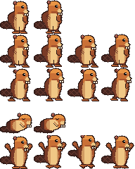
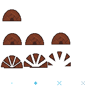

# Asset Gallery — figures & animation library

The catalog of every figure/avatar and animation asset in Beaver Buddy: what
exists, where it lives, its animation set, and its provenance. **Every new
figure or animation must be registered here** — this file is the library index.

Style rules and full provenance details: [`assets/STYLE.md`](../assets/STYLE.md).
ComfyUI generation pipeline: [`comfyui-avatar-generation.md`](comfyui-avatar-generation.md).

## Storage convention

- Committed sheets live in `assets/sprites/` as `<figure>.png` + a companion
  `<figure>.json` row manifest (`tile`, `fps` hint, `sheetWidth`/`sheetHeight`,
  `rows: [{ name, frames }]` — one animation per row, frames left to right,
  transparent padding after short rows).
- All frames are authored **right-facing**; the renderer mirrors horizontally
  for left-facing movement — left-facing source frames are never mixed in.
- Rig-ready character parts (`assets-src/parts/<figure>/`) and curated
  reference images (`assets-src/reference/`) are committed as source assets.
  Raw ComfyUI dumps (`assets-src/comfyui/`) and pre-review bake output
  (`assets-src/baked/`) stay gitignored — only assets that are actually used
  get committed.
- The renderer loads sheets via `loadSheet`/`loadLodgeSheet` in
  `src/renderer/sprites.ts` (plain canvas `drawImage`, no sprite library).

## Figures

### Beaver — baby

- **Files:** `assets/sprites/beaver-baby.png` + `.json` — 192×192 sheet, 96×96
  tiles, fps hint 8
- **Animations:** `idle` (1 frame), `walk` (2 frames)
- **Provenance:** user-generated art, ingested via
  `scripts/gen-sprites/ingest-images.mjs` (BL-11); colors ship as generated
  (palette rule waived by owner decision — see STYLE.md)
- **Status:** final

### Beaver — teen

- **Files:** `assets/sprites/beaver-teen.png` + `.json` — 192×192 sheet, 96×96
  tiles, fps hint 8
- **Animations:** `idle` (1 frame), `walk` (2 frames)
- **Provenance:** user-generated art, ingested via
  `scripts/gen-sprites/ingest-images.mjs` (BL-11)
- **Status:** final

### Beaver — adult

- **Files:** `assets/sprites/beaver-adult.png` + `.json` — 192×192 sheet, 96×96
  tiles, fps hint 8
- **Animations:** `idle` (1 frame), `walk` (2 frames)
- **Provenance:** **placeholder** — mechanically derived from the teen sheet
  (crop to content bbox + nearest-neighbor upscale) by
  `scripts/gen-sprites/build-adult-placeholder.ts` (`npm run
  assets:adult-placeholder`); byte-deterministic
- **Status:** placeholder — final adult art is still open (flight-plan #7)

### Hatch lodge

- **Files:** `assets/sprites/lodge.png` + `.json` — 192×192 sheet, 48×48 tiles
  (drawn at `LODGE_SCALE = 2` → 96 px on screen), fps hint 10
- **Animations:** `idle` (1 frame), `shake` (3), `burst` (3), `spark` (4 —
  8×8 particles centered in the 48×48 tile)
- **Provenance:** pixel maps authored by OpenAI Codex, rendered by
  `scripts/gen-sprites/build.ts` (`npm run assets:build`); fully palette-bound
  per STYLE.md
- **Status:** final

## In production (not yet in the app)

New figures, evolution stages, and more complex animations (e.g. the parachute
drop, a growing tree) are produced through the ComfyUI parts pipeline and the
dev-time PixiJS puppet studio (ADR 003, `tools/puppet-studio/`). Baked output
lands in the gitignored `assets-src/baked/`, passes the normal asset review,
and is then ingested into `assets/sprites/` — with an entry in this gallery.

## Adding a new figure or animation

1. Author/generate the art per `assets/STYLE.md` (right-facing frames only).
2. Bake/ingest it through the pipeline (`scripts/gen-sprites/` or
   `tools/puppet-studio/`) — never hand-place files into `assets/sprites/`.
3. Ship `<figure>.png` + `<figure>.json` following the manifest format above.
4. Record provenance in `assets/STYLE.md` (generator, date, human cleanup).
5. Add or update the entry in this gallery.
6. Run the design gate for materially visible changes
   (`docs/design-reviews/`).
